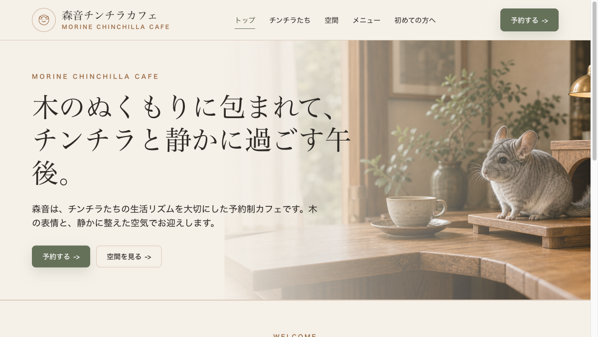

# 森音チンチラカフェ

木のぬくもりと静かな高級感を軸にした、架空のチンチラカフェのWebサイトです。  
かわいさを前面に出しすぎず、落ち着いた配色、余白、写真表現で「ゆっくり過ごせる場所」に見えることを意識して制作しました。



## サイト概要

このサイトでは、カフェの世界観と利用前に知りたい情報をまとめて確認できます。

| ページ | 内容 |
| --- | --- |
| トップ | ブランドの雰囲気、空間、予約導線を紹介 |
| チンチラたち | 在籍チンチラの性格や好きな場所を紹介 |
| 空間 | 座席、照明、音環境、温度と空気への配慮を紹介 |
| メニュー | 人向けのお茶と焼き菓子、チンチラ用のおやつを紹介 |
| 初めての方へ | 来店前に知っておきたい流れや注意点を案内 |
| ご予約 | コース選択、日時、人数などを入力する予約画面 |

## デザイン方針

- 木目を基調にした、温かく落ち着いた色づかい
- チンチラの毛並みに合う、やわらかなグレーと生成りの配色
- 装飾を増やしすぎず、写真と余白で上質さを見せる構成
- 日本向けサイトとして、見出しや案内文はすべて日本語で設計

## 使用技術

| 種別 | 内容 |
| --- | --- |
| フロントエンド | React |
| ビルドツール | Vite |
| スタイリング | Tailwind CSS |
| 画像 | AI生成画像をベースに制作 |

## 起動方法

```bash
npm install
npm run dev
```

ブラウザで表示されたローカルURLを開くと確認できます。

本番用ビルドは次のコマンドで作成できます。

```bash
npm run build
```

## 制作メモ

- 動物への影響を考え、空間紹介では「香り」の訴求を使っていません。
- メニューには人向けの軽食ではなく、チンチラ用のおやつを用意する構成にしています。
- 写真素材は、木の質感と静かな雰囲気がそろうように全体のトーンを合わせています。
